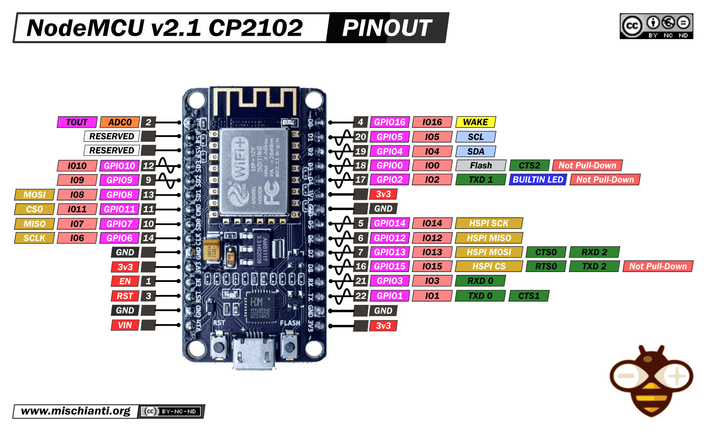

# Serial Peripheral Interface (SPI)

Serial Peripheral Interface (SPI) is a synchronous serial communications protocol commonly found in many hardware systems.

SPI is a de facto standard and has no formal specification; there are many variations of communication protocols all called "SPI." However, all implementations of SPI follow the same basic idea and are for the most part cross-compatible.

## Basic Operation

SPI follows the main-sub model.

In a multidrop configuration as shown in the figure, the main and all subs share the same SCLK, MOSI, and MISO lines, but there is a different CS line for each sub. This is as opposed to a daisy chain configuration in which all CS lines would be shared and the main and subs would daisy chain their MISO and MOSI lines together in a ring. However, not all main and sub devices support daisy chaining.

The CS is responsible for enabling a sub to communicate with the main. CS may be seen written as CS, which denotes that it is active low rather than active high. When the main wants to communicate with a sub, the main will select the sub using their CS line.

If either the sub or main require a waiting time after CS as per their spec sheet, then the main must wait for that much time. The main will generate a clock signal through SCLK, and then the main and sub will communicate in full duplex mode through MOSI and MISO where one bit is transferred each clock cycle.

## SCLK

The main is responsible for generating the SCLK signal at a frequency supported by the sub it is trying to communicate with. The SCLK should not exceed the sub's maximum clock speed, as per the sub's spec sheet.

The main and sub can use the SCLK to output and sample bits in different ways based on how they've defined the clock polarity (CPOL) and clock phase (CPHA) options:

| CPOL | SCLK Idles At        |
|------|----------------------|
| 0    | Logical low voltage  |
| 1    | Logical high voltage |

| CPHA | Bits Outputted When SCLK | Bits Sampled When SCLK |
|------|--------------------------|------------------------|
| 0    | transitions TO idle      | transitions FROM idle  |
| 1    | transitions FROM idle    | transitions TO idle    |

## SPI Modes

In order for the main and sub to communicate, the main must match its CPOL and CPHA with the sub's, following the sub's spec sheet. The combination of CPOL and CPHA results in 4 SPI operating modes:

| SPI Mode | CPOL | CPHA |
|----------|------|------|
| 0        | 0    | 0    |
| 1        | 0    | 1    |
| 2        | 1    | 0    |
| 3        | 1    | 1    |

## SPI in Development Boards

In common development and prototyping boards such as Arduinos and NodeMCUs, there are already pins for SPI communication.

Arduino Uno:

NodeMCU:

Note that in the NodeMCU, there are SPI and HSPI pins shown on the left and right of the board pinout figure, respectively. As per the [NodeMCU documentation](https://web.archive.org/web/20230324013738/https://nodemcu.readthedocs.io/en/release/modules/spi/), one should use the HSPI for communication with peripherals; the other SPI pins are used for communicating with the flash chip on development boards with flash functionality.

Although development boards commonly have dedicated CS pins, any digital pin can actually be used as long as it can output a high or low signal. If there aren't enough pins to spare, other solutions such as multiplexing or using shift registers may be employed to extend the maximum number of subs that can be selected. If the components support it, one can also use a daisy chain configuration to conserve pins.
