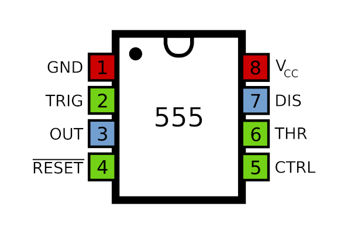
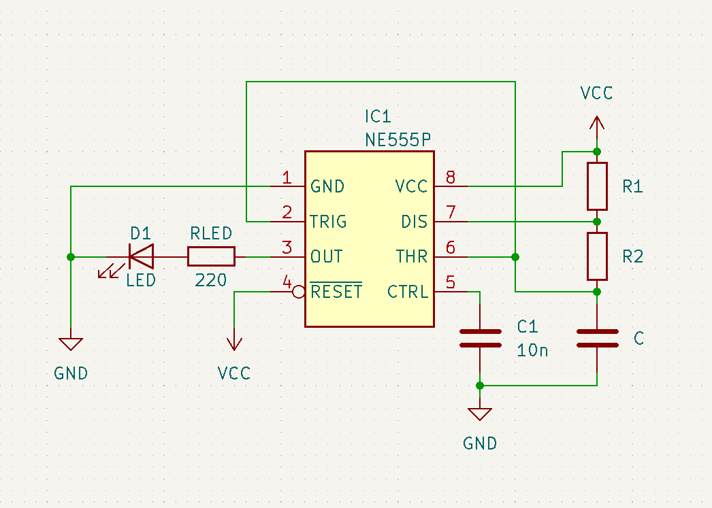
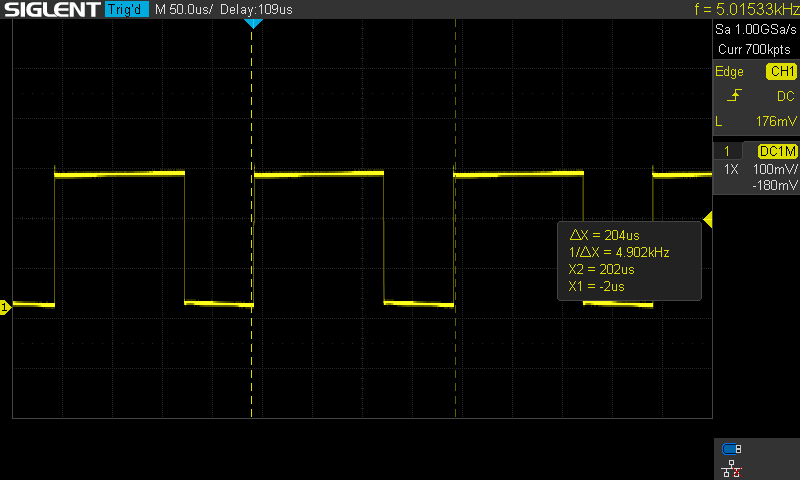
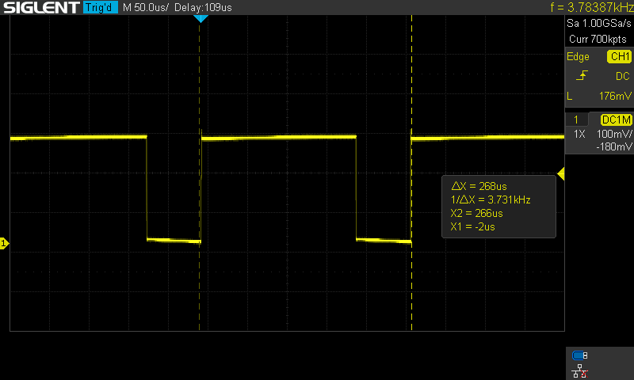
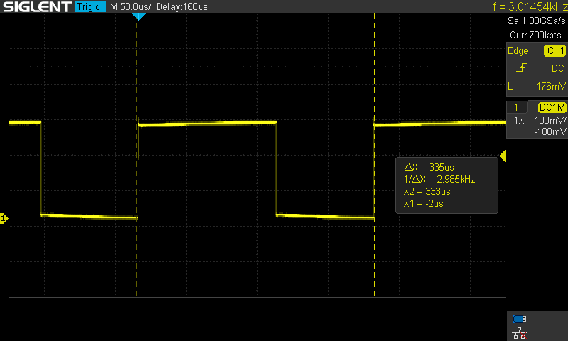
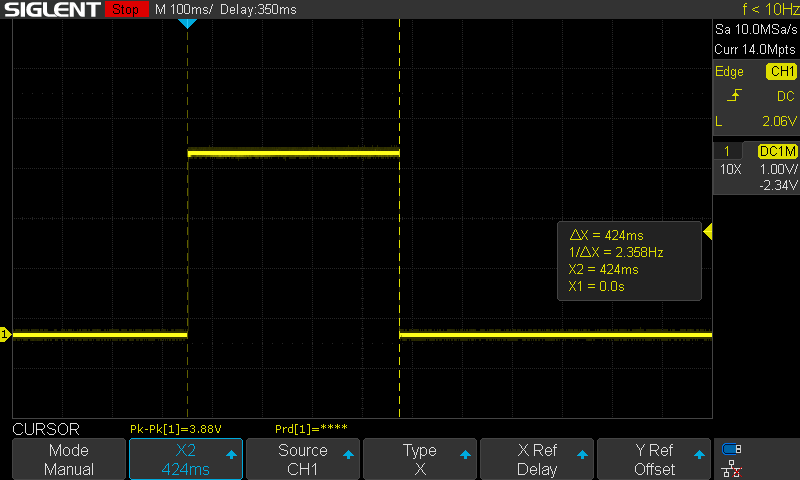
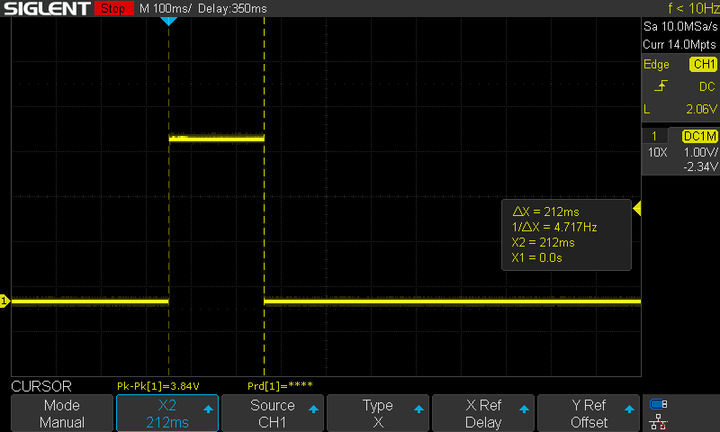
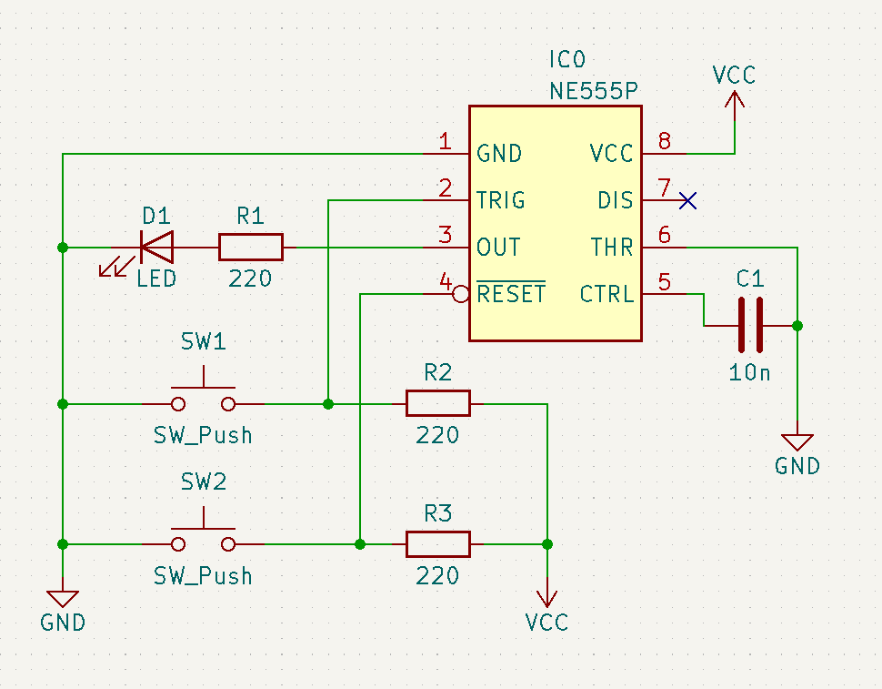

# 555

The 555 timer IC is a timer created by Signetics (Philips, aka NXP).

There are many variations of the 555 timer IC. The most common is the NE* variation, which is the original version of the 555.

## Pinout

The pinout of the 555 looks like so:

*By Inductiveload - Own work, Public Domain, https://commons.wikimedia.org/w/index.php?curid=7102271*

1. GND: ground, or reference voltage.
2. TRIG: trigger pin. When voltage on TRIG falls below 1/3 VCC, OUT will go to a high state and will remain in that high state so as long as TRIG stays at that low voltage.
3. OUT: output pin that outputs the signal generated by the timer, where the signal switches between VCC voltage and GND voltage.
4. RESET: when the reset pin is pulled low, the timer resets. If this is unused, it should be connected to VCC.
5. CTRL: control voltage pin that provides access to the internal voltage divider. By applying an external CTRL voltage, one can change the width of the OUT signal. If CTRL is unused, it should be connected to GND with a 10 nF capacitor.
6. THR: threshold voltage pin. When THR > 2/3 VCC, OUT goes from a high to a low state.
7. DIS: discharge to GND pin for the external timing capacitor during the discharge phase of the timing cycle.
8. VCC: input voltage. For NE555 timers, this is defined as anywhere from 4.5 V to 16 V.

## Operating Modes

The 555 has 3 primary operating modes:
1. Astable
2. Monostable
3. Bistable

### Astable

In astable mode, the 555 operates as a rectangle wave oscillator.

Note that $R_1$, $R_2$, and $C$ should be chosen such that they generate the desired high and low times:

$$
\begin{align*}
T_{high} &= 0.693 \times C \times (R_1 + R_2) \\
T_{low} &= 0.693 \times C \times R_2
\end{align*}
$$

These equations can be extended to calculate the period $T_p$, frequency $f$, and duty cycle $D$ in terms of $R$ and $C$:

$$
\begin{align*}
T_p &= 0.639 \times C \times (R_1 + 2R_2) \\
f &= \frac{1.44}{C \times (R_1+2R_2)} \\
D &= \frac{R_1 + R_2}{R_1 + 2R_2}
\end{align*}
$$

For example, the following rectangle waves are generated when $C = 100\,nF$, $R_1 = 1\,k\Omega$, and $R_2 = 1\,k\Omega$:

When $C = 100\,nF$, $R_1 = 2\,k\Omega$, and $R_2 = 1\,k\Omega$:

When $C = 100\,nF$, $R_1 = 1\,k\Omega$, and $R_2 = 2\,k\Omega$:

### Monostable

In monostable mode, the 555 operates as a one-shot pulse generator.

Note that the values of $R$ and $C$ should be chosen such that $T = 1.1 \times RC$. $T$ will be the output pulse width in units of seconds.

<video width="600" controls>
	<source src="./figures/555_monostable/circuit.mov" type="video/mp4">
</video>

Under an oscilloscope, with $R = 4\,M\Omega$ and $C = 100\,nF$, the circuit shown generates the following pulse width:

For contrast, when $R = 2\,M\Omega$ and $C = 100\,nF$, then the following pulse width is generated instead:

### Bistable

In bistable mode, the 555 operates as a set-reset latch.

Note that the resistor values in the schematic shown were chosen arbitrarily.

<video width="600" controls>
	<source src="./figures/555_bistable/circuit.mov" type="video/mp4">
</video>
