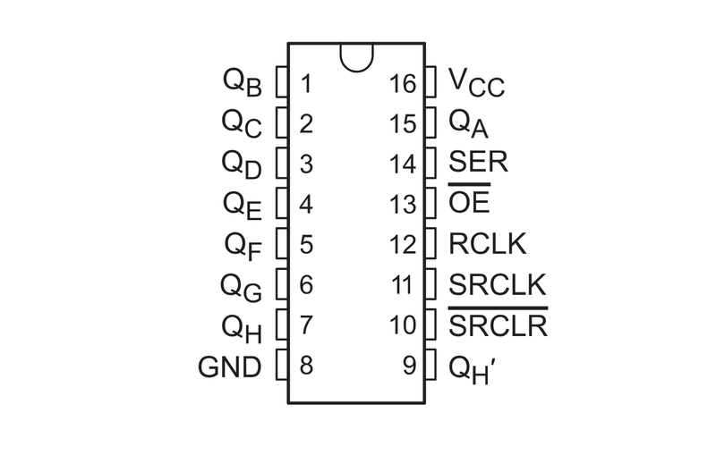
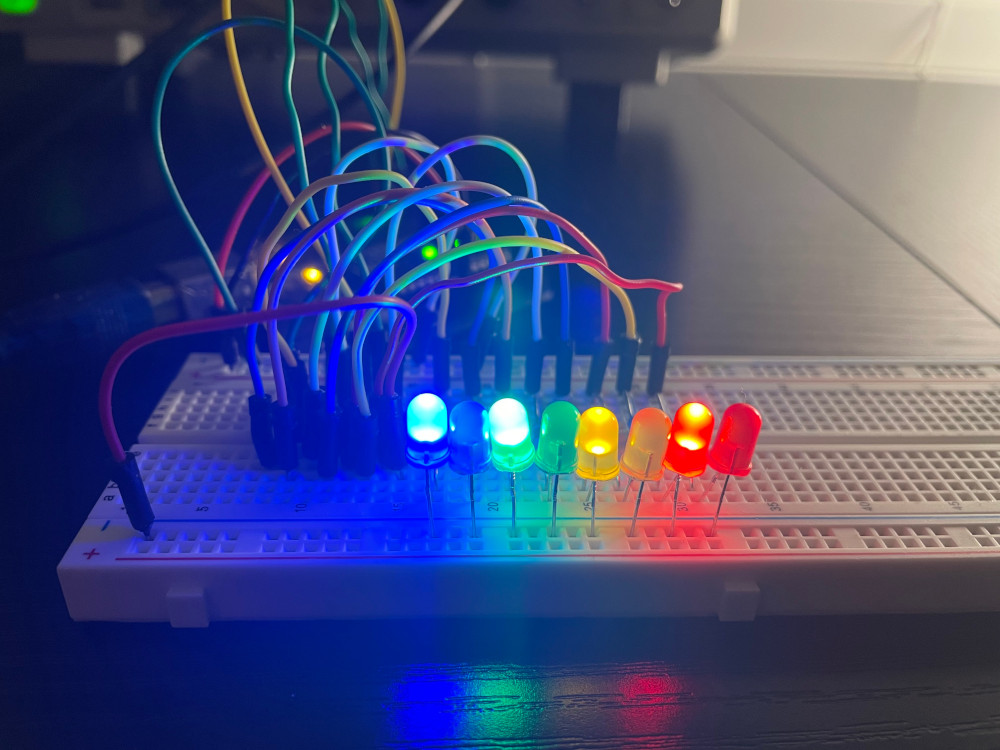
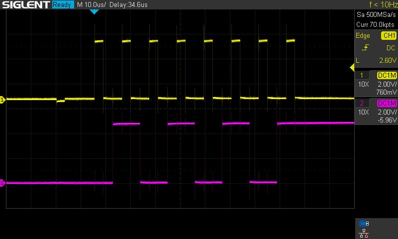
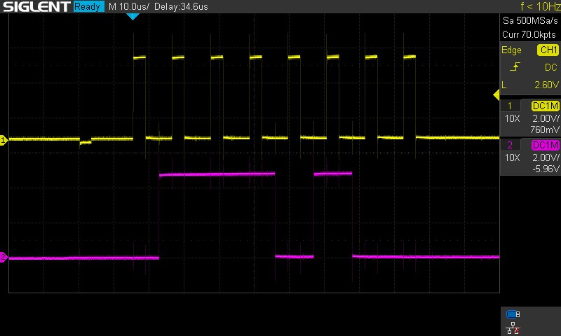

# 74HC595

The 74HC595 is an 8-bit shift register IC made by Texas Instruments.

Common variations of the 74HC595 include:
- \*N: the IC in a dual in-line package form.
- SN\*: the IC specifically manufactured by Texas Instruments.

## Pinout

The pinout of the 74HC595N looks like so:


*Courtesy Adafruit.*

- VCC: input voltage. In the SN\* variant, this is from 2-6 V with a nominal voltage of 5 V.
- GND: ground, or reference voltage.
- QA..QH: output pins.
- SER: serial input.
- <span style="text-decoration:overline">OE</span>: output enable. When it is pulled low, the output pins will function normally. When it is pulled high, the output pins are set to a high impedance state.
- RCLK: register clock, or latch pin. When this pin is pulled high, the bits that have been shifted into the shift register are written to the output.
- SRCLK: serial clock signal for SER.
- <span style="text-decoration:overline">SRCLR</span>: shift register clear. When this pin is pulled low, the shift register is cleared and the states of all output pins are reset.
- QH': The same as QH. This pin is used to allow shift registers to be daisy chained.

## Programming

The 74HC595 can be used from the Arduino Core.

```cpp
/* 74HC595 Example
 * This sketch demonstrates usage of the 74HC595 shift register IC using an
 * Arduino Uno.
 *
 * 74HC595 | Arduino Uno
 * --------|------------
 * SER     | 2
 * RCLK    | 3
 * SRCLK   | 4
 *
 * - Note that pins 2, 3, and 4 were chosen arbitrarily. Any pin can actually be
 *   used as long as it can output a high or low voltage. PWM is not needed.
 * - VCC and GND should be connected according to the logic level. The 74HC595
 *   supports 2-6 V with a nominal voltage of 5 V.
 * - \overline{OE} should be pulled low.
 * - \overlne{SRCLR} should be pulled high.
 */

#define SER    2
#define RCLK   3
#define SRCLK  4

#define VALUE 0b10101010

void setup()
{
	pinMode(SER  , OUTPUT);
	pinMode(RCLK , OUTPUT);
	pinMode(SRCLK, OUTPUT);

	/* Set the latch low so we can shift data in. */
	digitalWrite(RCLK, LOW);

	/* Shift the data into the register. In LSBFIRST, the leftmost bit is QA. */
	shiftOut(SER, SRCLK, LSBFIRST, VALUE);

	/* Set the latch high so that the bits shifted in are pushed to QA-QH. */
	digitalWrite(RCLK, HIGH);
}

void loop() {}
```

When QA..QH are connected to LEDs, the code results in the following output:



Under an oscilloscope, the SCLK (yellow) and SER (purple) look like so:



For contrast, if the value were `0b00101110` instead of `0b10101010`, then the SCLK (yellow) and SER (purple) would instead look like this under an oscilloscope:


